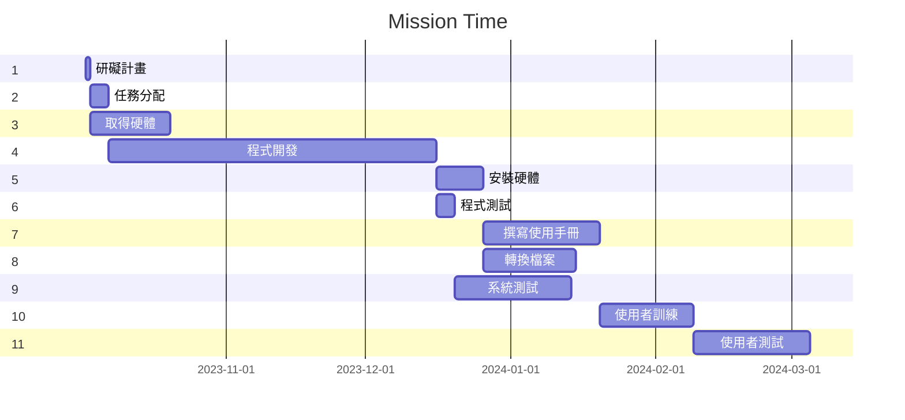

# 甘特圖
### Mermaid

```mermaid
gantt
    title Mission Time

    section 1
    研礙計畫           :a1, 2023-10-02, 1d
    section 2
    任務分配     :after a1  , 4d
    section 3
    取得硬體     :after a1  , 17d
    section 4
    程式開發      :a4, 2023-10-7  , 70d
    section 5
    安裝硬體     :a5, after a4   ,10d
    section 6
    程式測試    :a6, after a4   ,4d
    section 7
    撰寫使用手冊    :a7, after a5 ,25d
    section 8
    轉換檔案     :after a5  , 20d
    section 9
    系統測試     :a9,after a6 , 25d
    section 10
    使用者訓練     :a10, after a7 and a8 , 20d
    section 11
    使用者測試     :after a9 and a10 , 25d
 


```


```
# PERT 圖

# 關鍵路徑
關鍵路徑:1->2->4->6->9->11
